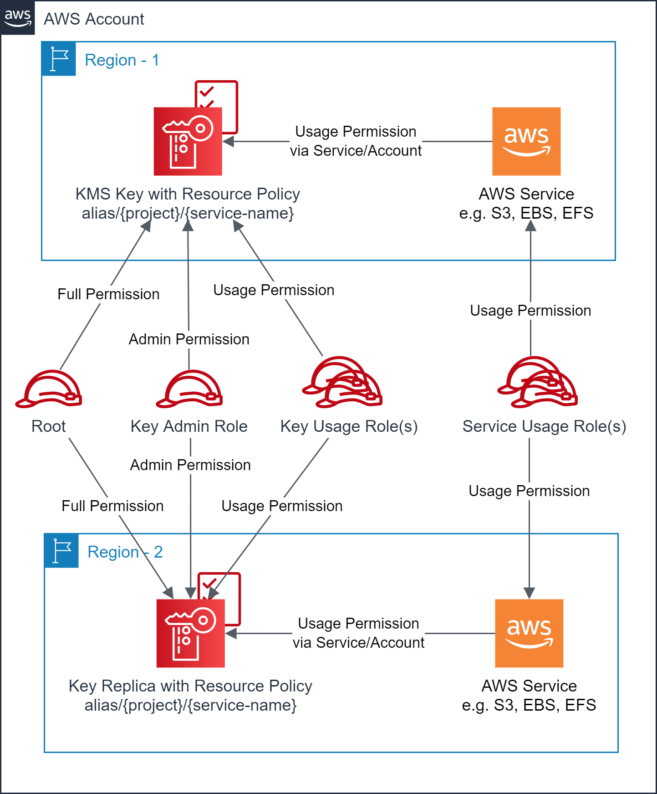

# Scale usage of AWS KMS keys for AWS Services with multi-region replica and cross-account access

This solution is a set of [Terraform](https://www.terraform.io/) modules that provision symmetric customer managed [AWS KMS](https://aws.amazon.com/kms/) keys for use by the [target AWS Services](#supported_services). You can optionally manage the key resource policy for the cross-account access via the AWS Services and the account principals. An additional module is included that supports creating [multi-region replica keys](https://docs.aws.amazon.com/kms/latest/developerguide/multi-region-keys-replicate.html) in another region. The full set of features is listed [here](#features). The solution also provides three example scenarios of how the solution solves common enterprise use cases.

## Introduction

AWS Key Management Service (KMS) is a managed service that makes it easy for you to create and control the cryptographic keys that are used to protect your data. AWS KMS is integrated with many [AWS Services](https://aws.amazon.com/kms/features/#AWS_Service_Integration) and integrates with AWS CloudTrail to log use of your KMS keys for auditing, regulatory, and compliance needs. AWS KMS uses an [Envelope encryption](https://docs.aws.amazon.com/kms/latest/developerguide/concepts.html#enveloping) strategy to protect the keys that encrypt data. Envelope encryption is the practice of encrypting plaintext data with a data key, and then encrypting the data key with a second key, known as the root key. AWS KMS protects the encryption keys by storing and managing them securely. Root keys never leave the AWS KMS unencrypted. Key resource policy along with IAM policies controls the access to the AWS KMS APIs.

AWS KMS keys can be [AWS owned, AWS managed or customer managed](https://docs.aws.amazon.com/kms/latest/developerguide/concepts.html#key-mgmt). Some AWS Services encrypt the data, by default, with an AWS owned key or an AWS managed key. Some AWS Services support customer managed keys. Use a separate customer managed AWS KMS key for each AWS Service that supports it for fine-grained access control. This best practice helps in defining scoped down permissions to the KMS keys and hence the data to the authorized users of the AWS Services.

Many large organizations have an AWS multi-account strategy. A common example is a `Security` account that owns the AWS security resources. An administrator in the `Security` account manages the lifecycle of the AWS security resources. One approach to scale the control of the AWS KMS keys across the accounts is to create the keys in a `Security` account and [allowing cross-account access](https://docs.aws.amazon.com/kms/latest/developerguide/key-policy-modifying-external-accounts.html) to the trusted accounts in the key resource policy, as shown in the sample resource policy below:
```json
{
    "Sid": "Allow use of the key to the cross-account owner",
    "Effect": "Allow",
    "Principal": {
        "AWS": [
            "arn:aws:iam::<truested-account-id-1>:root",
            "arn:aws:iam::<trusted-account-id-2>:root",
            "..."
        ]
    },
    "Action": [
        "kms:Encrypt",
        "kms:Decrypt",
        "kms:ReEncrypt*",
        "kms:GenerateDataKey*",
        "kms:DescribeKey"
    ],
    "Resource": "*"
}
```
A trusted account may further delegate these permissions to IAM principals within their own account using the IAM policies.
```json
{
    "Sid": "Allow use of this KMS key from Security Account",
    "Effect": "Allow",
    "Principal": {
        "AWS": [
            "arn:aws:iam::<trusted-account-id-1>:role/RoleInMyAccount",
            "arn:aws:iam::<trusted-account-id-1>:user/UserInMyAccount"
        ]
    },
    "Action": [
        "kms:Encrypt",
        "kms:Decrypt",
        "kms:ReEncrypt*",
        "kms:GenerateDataKey*",
        "kms:DescribeKey"
    ],
    "Resource": "arn:aws:kms:<aws-region>:<security-account-id>:key/<key-id>"
}
```
Another approach is to allow access using `kms:ViaService` and `kms:CallerAccount` conditions for the authorized principals of the trusted account(s) in the key resource policy.
```json
{
    "Sid": "Allow access through <aws-service> for all principals in the account(w) that are authorized to use <aws-service>",
    "Effect": "Allow",
    "Principal": {
        "AWS": "*"
    },
    "Action": [
        "kms:ReEncrypt*",
        "kms:Encrypt",
        "kms:DescribeKey",
        "kms:Decrypt",
        "kms:CreateGrant"
    ],
    "Resource": "*",
    "Condition": {
        "StringEquals": {
            "kms:CallerAccount": [
                "<owner-account-id>",
                "<trusted-account-id-1>",
                "<trusted-account-id-2>"
            ],
            "kms:ViaService": "<aws-service>.<aws-region>.amazonaws.com"
        }
    }
}
```
AWS KMS also supports [multi-region keys](https://docs.aws.amazon.com/kms/latest/developerguide/multi-region-keys-overview.html), which are copies of the AWS KMS keys in different AWS Regions. The related multi-region keys have the same key material and key ID, hence cross-region encryption/decryption can occur without re-encryption or cross-region API calls. A multi-region key in each AWS Region has its own alias, tags, key resource policy, grants, and status (enabled/disabled). These are suitable for many common data security scenarios such as disaster recovery, multi-region applications, global data management, etc.

## <a id="features"></a>Features

The solution has following features:

- Create the AWS KMS keys along with key resource policy and [alias](https://docs.aws.amazon.com/kms/latest/developerguide/alias-about.html) suitable for the [target AWS Services](#supported_services).
- Create multi-region replica key with key resource policy and alias in another region.
- Specify one or more IAM roles for the `Administration` of the keys in the owner account.
- Specify zero or more IAM roles for the `Usage` of the keys from the owner account and/or trusted-account(s).
- Specify zero or more trusted accounts for the cross-account root access.
- Enable cross-account access via service authorization pattern.
- Enable multi-region for any of the supported keys.
- Disable key rotation for any of the supported keys.
- Override key resource policy for any of the supported keys.
- Uniform key alias naming and common properties for the keys.
- Uniform names and tags for the provisioned resources.

## Prerequisites

- The target AWS Account(s) and AWS Region(s) are identified.
- The AWS User/Role executing the Terraform scripts must have permissions to provision the target resources in the owner account.
- The Terraform CLI (`version = ">= 1.1.9"`) is installed.
- Terraform backend provider and state locking providers are identified and bootstrapped.
  - An [example bootstrap](https://github.com/aws-samples/aws-tf-kms/tree/main/bootstrap) module/example is provided that provisions an Amazon S3 bucket for Terraform state storage and Amazon DynamoDB table for Terraform state locking.
    - The Amazon S3 bucket name must be globally unique.
- A unique project code name e.g., `appx` is identified that will be used to uniformly name the key aliases.
- Uniform resource tagging scheme is identified.
  - The examples use only two tags: `Env` and `Project`

## Usage

- Use the module via [GitHub source](https://www.terraform.io/language/modules/sources#github) or copy the module into your repository.
- Incorporate the module in your administration [CI](https://aws.amazon.com/devops/continuous-integration/)/[CD](https://aws.amazon.com/devops/continuous-delivery/) [pipeline](https://docs.aws.amazon.com/codepipeline/latest/userguide/concepts.html) as appropriate.
- For multi-account strategy, this module should be used by the `Security` account administrator or the pipeline.

## Scenarios

This solution primarily supports the following scenarios though many other scenarios are possible.

### Scenario 1: Create single-region AWS KMS key(s) in an account for the target AWS Services
Create one or more single-region AWS KMS keys in the owner account along with key resource policies and aliases that can be used by the target AWS Services.

<p align="center"></p>

- Account owner has full access to the key(s)
- Key Admin role has administrative access to the key(s)
- Key Usage role(s) have the usage access to the key(s)
- Target AWS Service usage role(s) have the usage access to the key via the target AWS Service.

Refer [examples/kms/scenario1](https://github.com/aws-samples/aws-tf-kms/tree/main/examples/kms/scenario1/) to execute this scenario.

### Scenario 2:  Create multi-region AWS KMS key(s) in the primary region and multi-region replica key in another region(s)
Create one or more multi-region AWS KMS keys along with key resource policies and aliases in the primary region, along with multi-region replica key(s) in another region(s). The target AWS Service in the secondary region(s) will be able to use the Key replica via the known alias.

<p align="center"></p>

- Account owner has full access to the key(s) and replica key(s)
- Key Admin role has administrative access to the key(s) and replica key(s)
- Key Usage role(s) have the usage access to the key(s) and replica key(s)
- Target AWS Service usage role(s) have the usage access to the key or replica key via the target AWS Service in the respective region.

Refer [examples/kms/scenario2](https://github.com/aws-samples/aws-tf-kms/tree/main/examples/kms/scenario2/) to execute this scenario.

### Scenario 3: Create AWS KMS key(s) in the owner account and allow cross-account access via AWS Services and the account principals
Create one or more AWS KMS keys in the one account. Allow principal(s) and AWS Services in the trusted account(s) to use the AWS KMS keys in their account.

<p align="center"></p>

- Account owner has full access to the key(s)
- Key Admin role in the owner account has administrative access to the key(s)
- Key Usage role(s) in the owner account have the usage access to the key(s)
- Target AWS Service usage role(s) in the owner account have the usage access to the key via the target AWS Service in the owner account
- Trusted account `root` has the usage and grand access to the Key(s). It can delegate usage access to other principals in the trusted account.
- Key Usage role(s) in the trusted account have the usage access to the key(s)
- Target AWS Service usage role(s) in the trusted account have the usage access to the key via the target AWS Service in the trusted account


Refer [examples/kms/scenario3](https://github.com/aws-samples/aws-tf-kms/tree/main/examples/kms/scenario3/) to execute this scenario.

## <a id="supported_services"></a>Supported Services

This set of modules supports creating the AMS KMS key along with key resource policy and alias that can be used by the following AWS Services.
- [Amazon S3](https://docs.aws.amazon.com/AmazonS3/latest/userguide/UsingKMSEncryption.html)
- [Amazon EBS](https://docs.aws.amazon.com/AWSEC2/latest/UserGuide/EBSEncryption.html)
- [Amazon EFS](https://docs.aws.amazon.com/efs/latest/ug/encryption-at-rest.html)
- [Amazon RDS](https://docs.aws.amazon.com/AmazonRDS/latest/UserGuide/Encryption.html)
- [Amazon DynamoDB](https://docs.aws.amazon.com/amazondynamodb/latest/developerguide/EncryptionAtRest.html)
- [AWS Lambda](https://docs.aws.amazon.com/lambda/latest/dg/security-dataprotection.html#security-privacy-atrest)
- [Amazon CloudWatch Logs](https://docs.aws.amazon.com/AmazonCloudWatch/latest/logs/encrypt-log-data-kms.html)
- [Amazon SNS](https://docs.aws.amazon.com/sns/latest/dg/sns-key-management.html)
- [Amazon SQS](https://docs.aws.amazon.com/AWSSimpleQueueService/latest/SQSDeveloperGuide/sqs-key-management.html)
- [AWS Backup](https://docs.aws.amazon.com/aws-backup/latest/devguide/encryption.html)
- [AWS Secrets Manager](https://docs.aws.amazon.com/secretsmanager/latest/userguide/security-encryption.html)
- [AWS Systems Manager Parameter Store](https://docs.aws.amazon.com/systems-manager/latest/userguide/data-protection.html#data-encryption)
- [AWS Systems Manager Session Manager](https://docs.aws.amazon.com/systems-manager/latest/userguide/session-preferences-enable-encryption.html)
- [Amazon Kinesis](https://docs.aws.amazon.com/streams/latest/dev/server-side-encryption.html)
- [AWS Glue](https://docs.aws.amazon.com/glue/latest/dg/encryption-at-rest.html)
- [AWS ACM](https://docs.aws.amazon.com/acm/latest/userguide/data-protection.html)

## Future Enhancements

- The solution supports Symmetric KMS keys. It can be enhanced to support Asymmetric KMS keys.
- The solution can be enhanced to support more AWS Services.
- The solution support common use cases and sufficient key resource policies. It can be enhanced to further scope-down the policies.

## Security

See [CONTRIBUTING](https://github.com/aws-samples/aws-tf-kms/blob/main/CONTRIBUTING.md#security-issue-notifications) for more information.

## License

This library is licensed under the MIT-0 License. See the [LICENSE](https://github.com/aws-samples/aws-tf-kms/blob/main/LICENSE) file.
