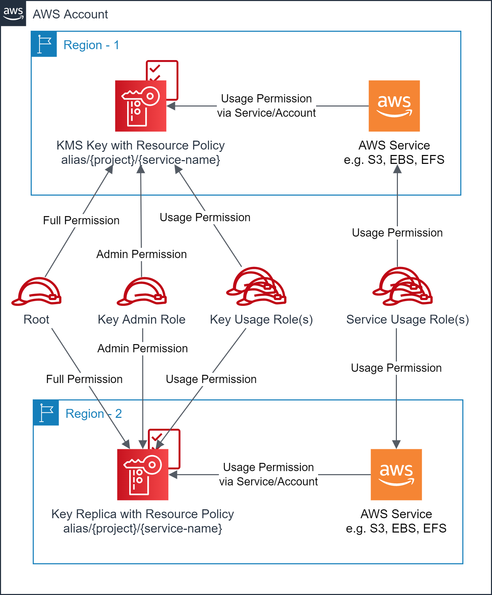

# Scenario 2:  Create multi-region AWS KMS key(s) in the primary region and multi-region replica key in another region(s)
Create one or more multi-region AWS KMS keys along with key resource policies and aliases in the primary region, along with multi-region replica key(s) in another region(s). The target AWS Service in the secondary region(s) will be able to use the Key replica via the known alias.

- Account owner has full access to the key(s) and replica key(s)
- Key Admin role has administrative access to the key(s) and replica key(s)
- Key Usage role(s) have the usage access to the key(s) and replica key(s)
- Target AWS Service usage role(s) have the usage access to the key or replica key via the target AWS Service in the respective region.

## Prerequisites

- One or more IAM roles for the `Administration` of the keys are identified.
- Zero or more IAM roles for the `Usage` of the keys are identified.
- A unique alias prefix is identified that will be used to uniformly name the key aliases.
- One or more regions are identified for multi-region replica key.
- Terraform backend provider and state locking providers are identified and bootstrapped.
  - An [example bootstrap](../../../bootstrap) module/example is provided that provisions Amazon S3 for Terraform state storage and Amazon DynamoDB for Terraform state locking.
- Modify `terraform.tfvars` to match your requirements. 

## Execution

- cd to `examples/kms/scenario2` folder.
- Modify `backend "S3"` section in the `provider.tf` with correct values for `region`, `bucket`, `dynamodb_table`, and `key`.
  - Use provided values as guidance.
- Modify `terraform.tfvars` to your requirements.
  - Use provided values as guidance.
- Make sure you are using the correct AWS Profile that has permission to provision the target resources.
  - `aws sts get-caller-identity`
- Execute `terraform init` to initialize Terraform.
- Execute `terraform plan` and verify the changes.
- Execute `terraform apply` and approve the changes to provision the resources.

<!-- BEGIN_TF_DOCS -->
## Providers

No providers.

## Modules

| Name | Source | Version |
|------|--------|---------|
|  [kms\_key\_replicas\_use2](#module\_kms\_key\_replicas\_use2) | ../../../modules/aws/kms_replica | n/a |
|  [kms\_key\_replicas\_usw1](#module\_kms\_key\_replicas\_usw1) | ../../../modules/aws/kms_replica | n/a |
|  [kms\_key\_replicas\_usw2](#module\_kms\_key\_replicas\_usw2) | ../../../modules/aws/kms_replica | n/a |
|  [kms\_keys](#module\_kms\_keys) | ../../../modules/aws/kms | n/a |

## Resources

No resources.

## Inputs

| Name | Description | Type | Default | Required |
|------|-------------|------|---------|:--------:|
|  [env\_name](#input\_env\_name) | Environment name e.g. dev, prod | `string` | n/a | yes |
|  [project](#input\_project) | Project name (prefix/suffix) to be used on all the resources identification | `string` | n/a | yes |
|  [region](#input\_region) | The AWS Region e.g. us-east-1 for the environment | `string` | n/a | yes |
|  [tags](#input\_tags) | Common and mandatory tags for the resources | `map(string)` | n/a | yes |

## Outputs

| Name | Description |
|------|-------------|
|  [kms\_keys](#output\_kms\_keys) | KMS Keys created |
|  [kms\_replicas\_use2](#output\_kms\_replicas\_use2) | KMS Key replicas created in us-east-2 |
|  [kms\_replicas\_usw1](#output\_kms\_replicas\_usw1) | KMS Key replicas created in us-west-1 |
|  [kms\_replicas\_usw2](#output\_kms\_replicas\_usw2) | KMS Key replicas created in us-west-2 |
<!-- END_TF_DOCS -->